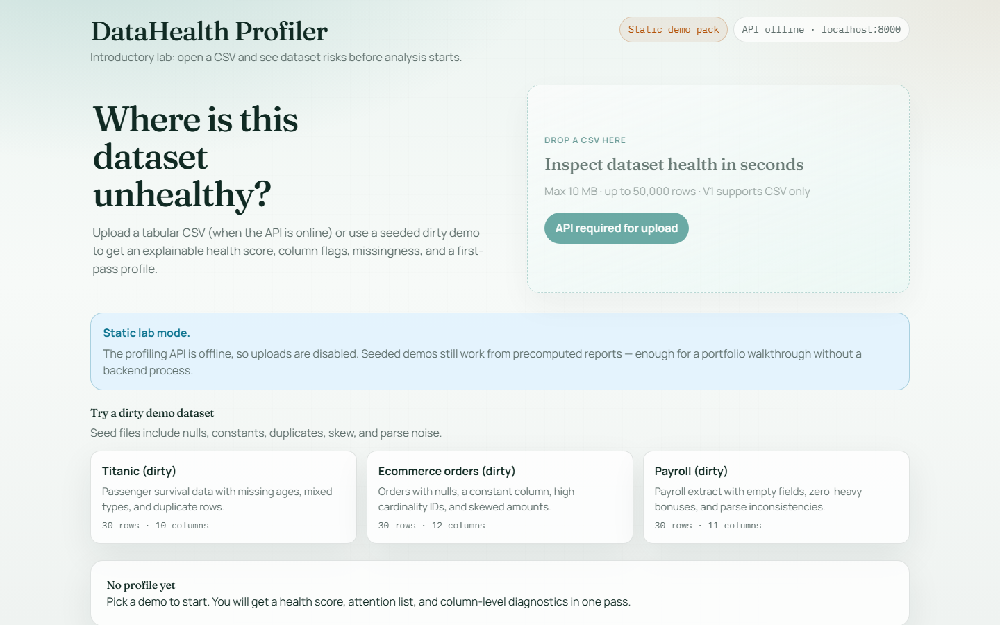
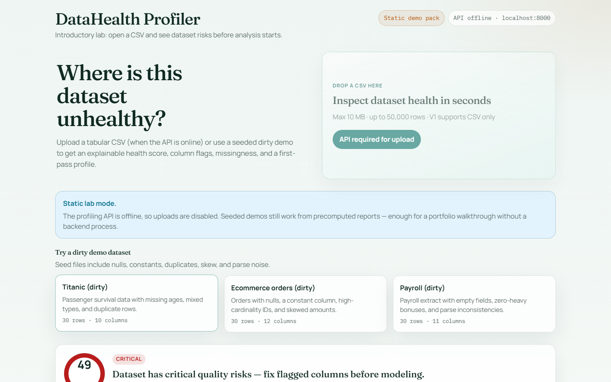
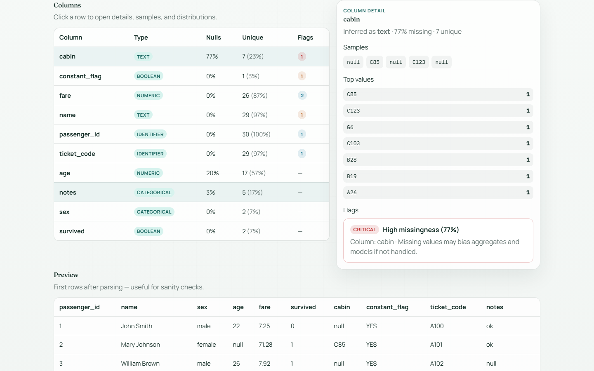

<div align="center">
  

  <h1>DataHealth Profiler</h1>
  <p><strong>Introductory lab:</strong> open a CSV and see where the dataset risks are — before EDA starts.</p>

  <p>
    <a href="https://datahealth-profiler.vercel.app">Live demo</a> ·
    <a href="./docs/DEMO_WALKTHROUGH.md">3–5 min walkthrough</a> ·
    <a href="./docs/PORTFOLIO_HANDOFF.md">Portfolio handoff</a>
  </p>

  <p>
    
    
    
    
    
  </p>
</div>







---

## Problem & audience

When a CSV arrives, analysis pressure starts before anyone knows if the file is usable. Analysts and students burn time on the same first-pass checklist: nulls, types, constants, duplicates, cardinality, dirty parses.

**Audience:** people learning or practicing analytics / data engineering who need a clear first read of tabular quality — not a governance platform.

## Solution & flow

1. Open the UI (static demos work even when the API is offline).
2. Click a seeded dirty dataset, or upload a CSV when the FastAPI backend is running.
3. Read health score → flags → column drill-down → preview.
4. Decide what to fix before modeling or dashboarding.

Central question: *is this dataset healthy enough to start, and which columns need attention first?*

## What this project demonstrates

- Product sense with deliberate **non-goals** (lab, not enterprise observability)
- Full-stack analytical path: **pandas profiling engine + typed API + Next.js UX**
- Explainable quality rules and a transparent score
- Portfolio DX: static demo pack, CI, docs, interview walkthrough
- Honest positioning next to heavier pipeline / auditor projects (no narrative overlap)

## Architecture

```txt
Next.js UI
  ├─ live: POST /api/profile (+ demos) → FastAPI + pandas + Pydantic
  └─ offline: /demo-reports/*.json snapshots (same engine export)
```

Details: [`docs/ARCHITECTURE.md`](./docs/ARCHITECTURE.md) · decisions: [`docs/TECHNICAL_DECISIONS.md`](./docs/TECHNICAL_DECISIONS.md)

## Stack

| Layer | Choice |
|-------|--------|
| UI | Next.js 15, TypeScript, Tailwind CSS 4 |
| API | FastAPI, Pydantic Settings |
| Profiling | pandas / numpy |
| Quality | pytest, ESLint, `tsc`, GitHub Actions |
| Demo hosting | Vercel (static demo pack; uploads need API) |

## Real status, demo & limitations

| Item | Status |
|------|--------|
| Local V1 (API + UI) | Runnable |
| Public UI demo | [datahealth-profiler.vercel.app](https://datahealth-profiler.vercel.app) |
| Static demos without API | Yes (`frontend/public/demo-reports`) |
| Public FastAPI host | Not deployed (uploads offline in public demo) |
| Auth / DB / monitoring | Out of scope on purpose |

**Limits:** CSV only · default 10 MB / 50k rows · heuristic flags · not a substitute for Great Expectations or warehouse DQ.

**Portfolio role:** **introductory lab (Tier C)** — teach and demo the first data-health pass. Deeper pipeline / public-data auditor stories belong in other repos.

## Quick start

### Requirements

Node 20+ · Python 3.11+ · npm · pip

### Backend

```bash
cd backend
python -m venv .venv
# Windows: .venv\Scripts\activate
# macOS/Linux: source .venv/bin/activate
pip install -r requirements.txt
uvicorn app.main:app --reload --port 8000
```

### Frontend

```bash
cd frontend
cp .env.example .env.local
npm install
npm run dev
```

Open http://localhost:3000  

Windows helpers: `scripts/dev-backend.ps1`, `scripts/dev-frontend.ps1`.

Regenerate static demos after profiler changes:

```bash
cd backend
.\.venv\Scripts\python ..\scripts\export_demo_reports.py
```

### Env

See [`.env.example`](./.env.example). Never commit secrets or personal CSVs.

## Tests & gates

```bash
cd backend && pytest -q
cd frontend && npm run lint && npm run typecheck && npm run build
```

Includes regression checks that static demo snapshots stay aligned with the live engine.

## Decisions & trade-offs

- **pandas in-process** for small/medium CSVs — fast lab, not a lakehouse engine
- **Separate Python API** keeps analytics idiomatic; UI stays TypeScript
- **Static demo snapshots** so the Vercel demo never depends on a paid API host
- **Explainable flags > opaque “AI quality”** — interviewable methodology
- **No auth/DB in V1** — scope control for a lab product

## Interview walkthrough (3–5 min)

See [`docs/DEMO_WALKTHROUGH.md`](./docs/DEMO_WALKTHROUGH.md).

Suggested arc: problem → click Titanic/Payroll → score/flags → open `profiler.py` → trade-offs → “next would be export/XLSX, not fake enterprise”.

## Docs map

- [`docs/PORTFOLIO_HANDOFF.md`](./docs/PORTFOLIO_HANDOFF.md)
- [`docs/AUDIT_REPORT.md`](./docs/AUDIT_REPORT.md)
- [`docs/HANDOFF.md`](./docs/HANDOFF.md)
- [`docs/DEPLOYMENT.md`](./docs/DEPLOYMENT.md)
- [`docs/TESTING.md`](./docs/TESTING.md)

## Author

**Felipe Alírio Baruja** — software developer & Statistics / Data Science student (USP)

- Portfolio: https://barujafe.vercel.app/
- GitHub: https://github.com/BarujaFe1/
- LinkedIn: https://www.linkedin.com/in/barujafe/

## License

MIT — see [LICENSE](./LICENSE).
